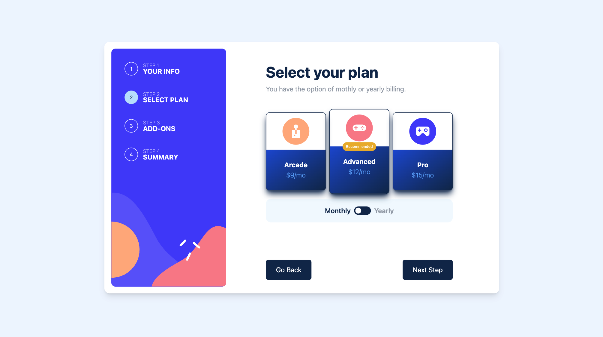

# 🚀 Frontend Mentor - Multi-step form

This is a solution to the [Multi-step form](https://www.frontendmentor.io/challenges/multistep-form-YVAnSdqQBJ).

## 👀 Overview

### 🏞️ Screenshot

### 🔗 Links

- [Solution URL:](https://github.com/eibii/multi-step-form-main/)
- [Live Site URL:](https://deluxe-souffle-cd72ad.netlify.app/)

## 👨🏻‍💻 My process

### 🛠️ Built with

- Semantic HTML5 markup
- [Angular](https://angular.io/) - JS framework
- [Tailwind](https://tailwindcss.com/) - Utility-first CSS framework

## 🧞 Commands

All commands are run from the root of the project, from a terminal:

| Command         | Action                                        |
| :-------------- | :-------------------------------------------- |
| `npm install`   | Installs dependencies                         |
| `npm run ng`    | Check if the Angular CLI is installed         |
| `npm run start` | Starts local dev server at `localhost:4200`   |
| `npm run build` | Build your production site to `./dist/`       |
| `npm run watch` | Initiate the process of observing the project |
| `npm run test`  | Starts the tests in the current directory     |

## ✍🏼 Author

- [Meet me](https://ercdev.com.br/)
